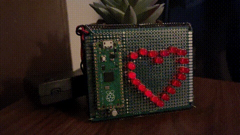

#  Raspberry Pi Pico Heartbeat Light
 

This project started mainly as a **hands-on soldering challenge** and as an excuse to properly try out my **TS101 soldering pen**.

It ended up becoming a deep dive into:
- Transistor basics
- PWM-controlled brightness
- Step-by-step debugging
- And practical perfboard routing decisions

The result is a pulsing LED heart driven by a Raspberry Pi Pico and a 2N2222A transistor.

# Table of contents
* [1.Demo](#-demo)
* [2.What it does](#what-it-does)
* [3.Parts I Used](#parts-i-used)
* [4.Why a Transistor Is Needed](#why-a-transistor-is-needed)
* [5.Power Setup & Voltage Decisions](#power-setup--voltage-decisions)
* [6.Software](#software)
* [7.Layout & Routing Decisions](#layout--routing-decisions)
* [8.Debugging & What I Learned the Hard Way](#debugging--what-i-learned-the-hard-way)
  * [8.A - Wrong resistor assumptions ](#1-wrong-resistor-assumptions)
  * [8.B - Base resistor mistake](#2-base-resistor-mistake)
  * [8.C - Multimeter “opens the valve” moment ](#3-multimeter-opens-the-valve-moment)
  * [8.D - Thought the Pico was dead ](#4-thought-the-pico-was-dead)
* [9.What I Learned](#what-i-learned)
* [10.Battery Life (Approximate)](#battery-life-approximate)

---
## 🎥 Demo

▶️ [Watch full demo video](video/heartled.mp4)

##  What It Does  

The LEDs form a heart shape and pulse in a double heartbeat pattern with fading by using pwm

## Parts I Used

- Raspberry Pi Pico 
    - Controls the fade pattern 
- 2N2222A NPN transistor 
    - Lets the Pico drive many LEDs 
- 5mm red diffused LEDs 
    - The heart 
- 100Ω resistors 
    - Current limiting 
- 1kΩ resistor 
    - Base resistor for the transistor 
- 3×AA battery holder  
    - Power source
- Perfboard 
    - Everything is soldered here 
- Solid wire / LED legs 
    - Routing traces 
- Header pins 
    - To mount the Pico 

> Note: 100Ω works but is a bit low for 3×AA (≈4.5V).  
> 150–220Ω would be safer for LED lifetime 

All LED cathodes meet at the transistor.

The transistor handles grounding:

- **Emitter → Ground**
- **Base → Pico GPIO through 1kΩ**
- **Collector → LED cathodes**

So the transistor acts like a **valve**:
when the Pico applies a signal to the base, current is allowed to flow through the LEDs.

---

##  Why a Transistor Is Needed

The Pico cannot directly drive 20+ LEDs from a GPIO pin.

The transistor:
- handles the LED current
- isolates the Pico
- allows PWM control of brightness

The Pico only controls the *base* — the transistor does the heavy lifting.

---

##  Power Setup & Voltage Decisions

Originally, I planned the project around **3V**, assuming I needed to match what the Pico and LEDs needed.

Later I learned that:
- the Pico accepts **VSYS up to ~5.5V**
- it regulates internally to **3.3V**
- LEDs can be powered directly from the battery rail

So I switched to **3×AA ≈ 4.5V**:

- battery → VSYS → Pico regulator
- battery → LED resistors → LEDs

This simplified the design and avoided extra regulators.

---

##  Software

The animation in `main.py` uses:

- **PWM** for brightness control
- **gamma correction** to match human vision
- **cosine easing** for smooth fades
- a **double-beat timing pattern**

The LEDs fade rather than blink, making the heart feel organic.

---

##  Layout & Routing Decisions

This was not random wiring.

The heart layout is **intentionally inverted**:

- **All GND (cathodes)** are routed toward the **inside** of the heart
- **All VCC (anodes)** are routed toward the **outside**

This made routing:
- cleaner
- more consistent
- easier to debug

LED legs and solid wire were used as bus rails to reduce clutter.

---

## Debugging & What I Learned the Hard Way

I went in thinking this was mostly soldering.

Reality: **half the project was debugging**.

### 1. Wrong resistor assumptions  
I calculated current assuming ~3V, then switched to 4.5V.

Result:
- LEDs ran brighter than expected
- PWM brightness limiting fixed it
- lesson learned about voltage assumptions

---

### 2. Base resistor mistake  
At one point, I accidentally used a **10kΩ resistor instead of 1kΩ** on the transistor base.

This meant:
- The transistor never fully turned on
- LEDs stayed dark
- Continuity testing revealed the issue

Replacing it with **1kΩ fixed everything instantly**.

---

### 3. Multimeter “opens the valve” moment  
While measuring between base and emitter, the LEDs suddenly lit up faintly.

This happened because:
- the multimeter injected a tiny current
- that current biased the transistor
- the transistor partially turned on

That’s when the “transistor as a valve” concept really clicked.

---

### 4. Thought the Pico was dead  
The Pico showed no signs of life.

The problem:
- bad VSYS solder joint

Reflowing the solder fixed it, the Pico was never dead.

---

## What I Learned

- Transistors don’t amplify voltage — they **control current**
- PWM is fast switching, not analog voltage
- A continuity tester is incredibly powerful
- Debugging should be systematic:
  1. Is power present?
  2. Does the signal reach the transistor base?
  3. Are LED resistors correct?
  4. Is ground truly shared?

---

## Battery Life (Approximate)

Because brightness is PWM-limited and the heart is not meant to be on constantly, values are approximate.

At ~60% max brightness:

- LED array: ~15–20 mA (average)
- Pico: ~30–50 mA

With 3×AA (~2000 mAh):
→ **roughly 20–30 hours** of runtime depending on usage.
